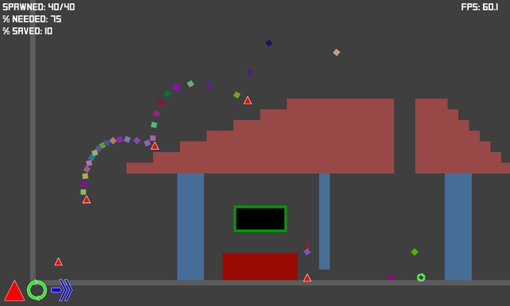
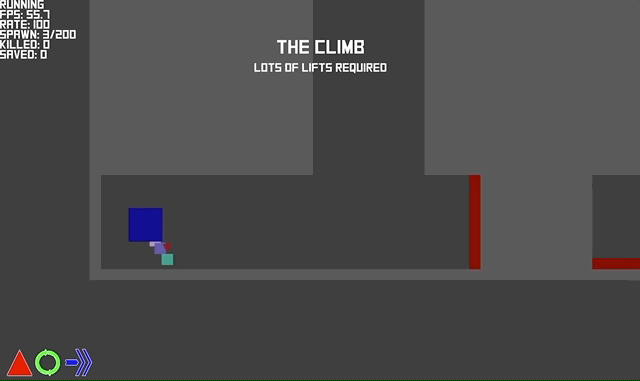

# Github Game Jam 2018 entry

## Theme
[HYBRID.](https://itch.io/jam/game-off-2018)

## Concept
A mashup of Lemmings and an ~~endless~~ runner sorta thing. The camera tracks the lead creep and using an ability (lift, change direction, dash) kills them but helps their friends who are hot on their heels.

## Controls
  - ``1`` -> lift
  - ``2`` -> change direction
  - ``3`` -> dash
  - ``space`` -> mass exodus
  - ``r`` -> restart level
  - ``n`` -> next level (if % NEEDED is met)
  - ``p`` -> previous level
  - ``+`` -> volume up
  - ``-`` -> volume down
  - ``w`` -> zoom in
  - ``s`` -> zoom out

## Implementation
  - Language: [Rust](https://www.rust-lang.org/)
  - Engine: [Amethyst](https://www.amethyst.rs/)
  - Physics: [nphysics](https://www.nphysics.org/)

## License
[MIT License](LICENSE-MIT)

## Notes
You can muck about with lots of settings in resources/config.ron. Try tweaking the number of creeps that spawn in the "spawner" section (defaults unless the level overrides them) or "spawn_overrides" (per level settings). You can change this file and press R in game to pick up level changes (only changes in the "levels" section can be reloaded in game, restart the game for anything else). If you get the syntax wrong it'll print an error to the console. It'll also fail to launch if the config file is invalid but the errors are pretty helpful mostly.

## Known issues
  - Nothing rendering on OSX Mojave until the window is resized [(fixed in next Amethyst release)](https://github.com/amethyst/amethyst/issues/1036)

## Preview

## Building
  - Install rust [(rustup makes it easy)](https://rustup.rs/)
  - Install [Amethyst dependencies](https://github.com/amethyst/amethyst#dependencies)
  - Clone this repo
  - Run run.sh for rust nightly or run_stable.sh for rust stable

## Binaries
You can download pre-built binaries from the [itch.io page](https://cs2dsb.itch.io/lemrunner)